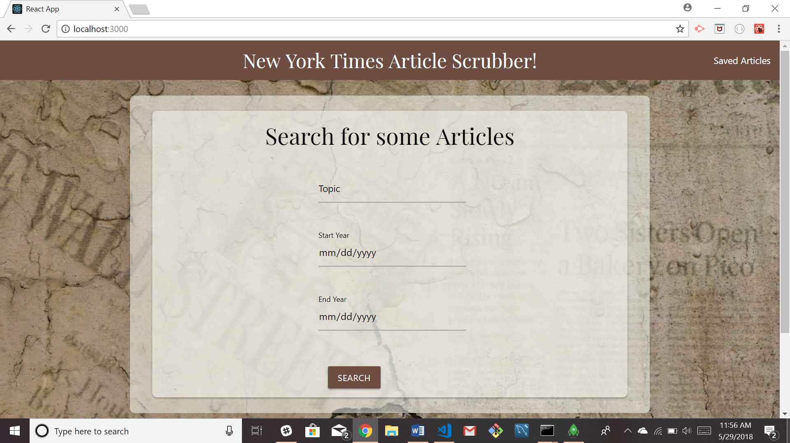
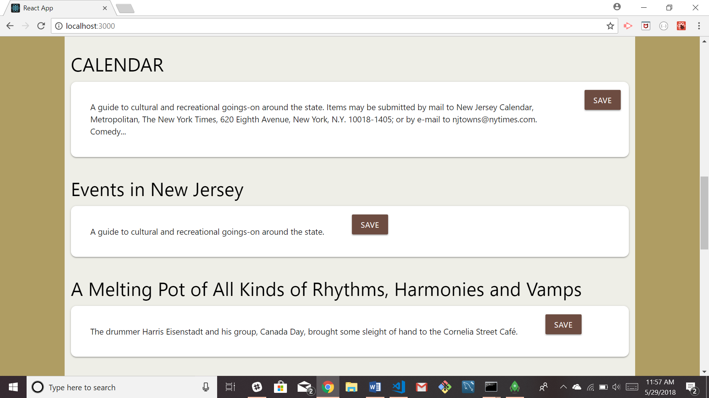
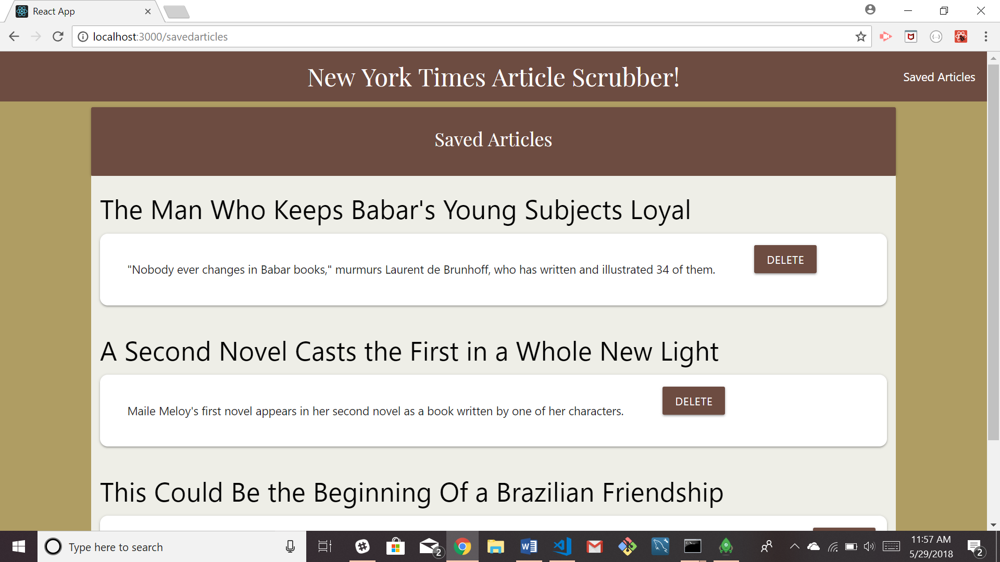

# NYTReact

This project was created by Jaime Halupka as a requirement for homework during University of Central Florida's Coding Bootcamp. 

### Screenshots

Main Screen

Searched Articles

Saved Articles

  
### Description

This application allows the user to search for New York Times articles according to a topic, a start date and end date.They then have the option of saving an article to be read at a later time. Saved articles also have the option of being deleted once read.

### Link to Application

[Heroku Link]()

### GIFs

[GIF Link](https://gfycat.com/gifs/detail/TepidQuestionableFunnelweaverspider)

